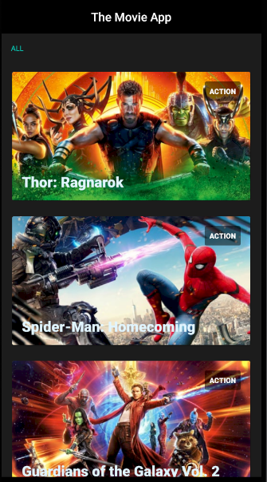
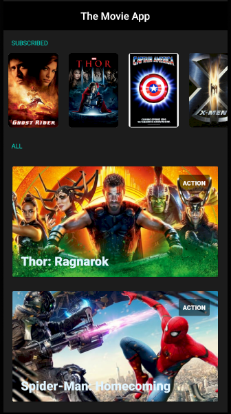
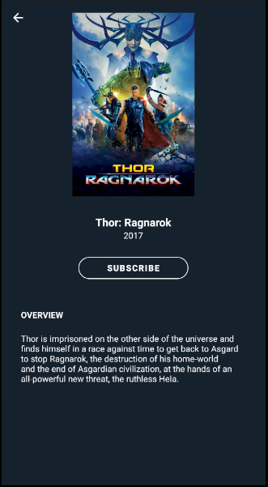
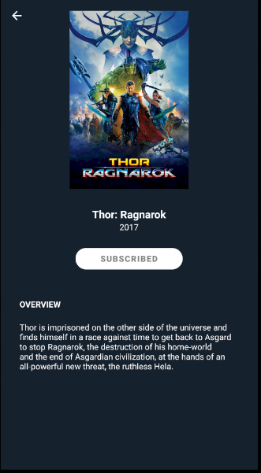

# The Movie App
Ejercicio técnico

## Funcionalidades realizadas:
* Listado principal
* Visualizacion del Detalle con parallax al scroll + color de fondo segun predominante de imagen
* Obtencion del genero de cada pelicula
* Suscripcion (local)

## Tecnologias utilizadas en este proyecto:
* Componentes base de Arquitectura Android Jetpack
  - AndroidX y Android KTX 
  - Kotlin
  - Lifecycles
  - LiveData
  - ViewModel
  - Navigation
  - Room

* Librerias 
  - Hilt: Inyeccion de Dependencias
  - Kotlin Corrutinas: Manejo de procesos en segundo plano
  - Retrofit2: Llamadas a API
  - Glide: Carga de imagenes

* UI
  - Fragments
  - Layouts
  - Pallete
  - Material Design

#### Configuracion de API KEY:
* Agregar en el root del proyecto un archivo llamado "apikey.properties" y dentro la clave: MOVIE_DB_API_KEY="XXXXXXXXXXXXXXXXXXXXXXX"

#### Capturas:
   

